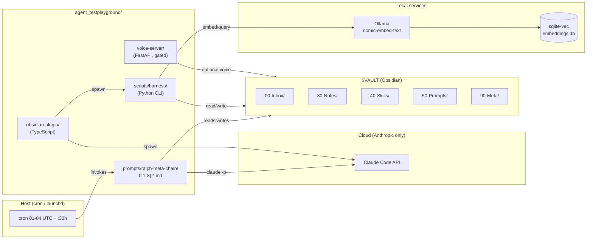

# agent_testplayground — Ralph Meta Chain

[](https://github.com/Wellux/agent_testplayground/actions/workflows/ci.yml)
[](LICENSE)

Local-first, Claude-Code-primary, Obsidian-backed self-improving agent.
Eight cron prompts run UTC daily; each one mines the previous run's
traces, hypothesizes improvements, runs cheap A/B experiments, and
rewrites the agent's own substrate (memory, skills, interactions,
prompts).

> Memory model lifted from Karpathy's LLM-Wiki (raw → wiki → schema).
> Prompt evolution lifted from GEPA × MAP-Elites × Reflexion.
> Retrieval = `sqlite-vec` + FTS5 hybrid via local Ollama embeddings.
> Skills lifted from Voyager (curriculum + prerequisites).

## Architecture



**Two layers, one branch.** Master-spec canonical layout under
`prompts/ralph-meta-chain/` is what runs going forward. Phase 1-6
reference (the original four root dirs) is archived under
`prompts/ralph-meta-chain/migration/_archive/_pre-migrated/` after
Round 8's `git mv` migration (2026-05-09).

## What's in this repo

| Path                                                      | What                                                       |
| --------------------------------------------------------- | ---------------------------------------------------------- |
| `prompts/ralph-meta-chain/0[1-8]-*.md`                    | Eight Ralph prompts (memory / skills / interaction / etc.) |
| `prompts/ralph-meta-chain/scripts/harness/`               | Python CLI: `ab`, `embed`, `query`, `compress`, `migration` |
| `prompts/ralph-meta-chain/obsidian-plugin/`               | Obsidian plugin (commands, status bar, views)              |
| `prompts/ralph-meta-chain/voice-server/`                  | FastAPI dispatcher (Phase 3, runtime gated)                |
| `prompts/ralph-meta-chain/install/install_cron.sh`        | Idempotent cron / launchd installer                        |
| `prompts/ralph-meta-chain/scripts/ralph_*.sh`             | Bash shims + 5 read-only validators                        |
| `prompts/ralph-meta-chain/{commands,skills,hooks}/`       | Claude-Code slash commands, skills, pre/post-tool hooks    |
| `prompts/ralph-meta-chain/{indexes,benchmarks,experiments}/` | Round 7 catalogs, scorecards, fixture buckets           |
| `prompts/ralph-meta-chain/{business-entity,migration,providers,vault-template}/` | Round 3-4 scaffolds          |
| `prompts/ralph-meta-chain/docs/`                          | 18+ canonical design docs                                  |
| `prompts/ralph-meta-chain/research/`                      | RESEARCH_NOTES, SYNTHESIS, watchlist, rubric               |

## Cron order (UTC)

| Time   | Prompt                              | Optimizes                                      |
| ------ | ----------------------------------- | ---------------------------------------------- |
| 01:00  | `04-research-ingest.md`             | GitHub-trending → vault inbox                  |
| 02:00  | `01-memory-optimizer.md`            | Atomic notes, MOCs, orphans (Karpathy LLM-Wiki)|
| 03:00  | `02-skills-optimizer.md`            | Reusable skills + revalidation (Hermes-style)  |
| 04:00  | `03-interaction-optimizer.md`       | A/B-tested prompt rewrites                     |
| 05:00  | `07-autoevolve.md`                  | Promote winners; deprecate losers              |
| 06:00  | `08-autoupdate.md`                  | Propose dep / tool bumps                       |
| :30 h  | `05-compress.md`                    | Context bloat / weekly daily-note rollups      |
| :15 h  | `06-autoheal.md`                    | Schema/link drift checks; escalations          |

## Quick start

```bash
git clone https://github.com/Wellux/agent_testplayground.git
cd agent_testplayground

# 1) Configure your vault
cp prompts/ralph-meta-chain/config.example.yml \
   prompts/ralph-meta-chain/config.yml
$EDITOR prompts/ralph-meta-chain/config.yml      # set vault_path

# 2) Build the Obsidian plugin
cd prompts/ralph-meta-chain/obsidian-plugin && npm install && npm run build
ln -s "$PWD" "$VAULT/.obsidian/plugins/ralph-meta-chain"
cd -

# 3) Install the Python harness
cd prompts/ralph-meta-chain/scripts/harness && uv sync \
   && cp .env.example .env
$EDITOR prompts/ralph-meta-chain/scripts/harness/.env  # ANTHROPIC_API_KEY
cd -

# 4) Pull the local embedding model + bootstrap index
ollama pull nomic-embed-text
./prompts/ralph-meta-chain/scripts/ralph_bootstrap_embed.sh

# 5) Install the cron / launchd entries
./prompts/ralph-meta-chain/install/install_cron.sh --dry-run   # preview
./prompts/ralph-meta-chain/install/install_cron.sh             # install

# 6) Tail the log
tail -f ~/.ralph.log
```

See `prompts/ralph-meta-chain/docs/OPERATIONS_MANUAL.md` for daily
checks, weekly review, troubleshooting, emergency procedures, and
the Round 8 rollback contract.

See `prompts/ralph-meta-chain/docs/INDEXING.md` for the embedding
bootstrap + sqlite-vec troubleshooting.

## Pointers

- [`prompts/ralph-meta-chain/docs/ROADMAP.md`](prompts/ralph-meta-chain/docs/ROADMAP.md) — round-by-round shipping log.
- [`prompts/ralph-meta-chain/docs/ARCHITECTURE.md`](prompts/ralph-meta-chain/docs/ARCHITECTURE.md) — system overview.
- [`prompts/ralph-meta-chain/docs/MEMORY_MODEL.md`](prompts/ralph-meta-chain/docs/MEMORY_MODEL.md) — three-layer Karpathy LLM-Wiki memory.
- [`prompts/ralph-meta-chain/docs/APPROVAL_GATES.md`](prompts/ralph-meta-chain/docs/APPROVAL_GATES.md) — LOW / MEDIUM / HIGH / CRITICAL.
- [`prompts/ralph-meta-chain/docs/SECURITY_PRIVACY.md`](prompts/ralph-meta-chain/docs/SECURITY_PRIVACY.md) — local-first model, threat model.
- [`prompts/ralph-meta-chain/docs/PROVIDER_NEUTRAL_ARCHITECTURE.md`](prompts/ralph-meta-chain/docs/PROVIDER_NEUTRAL_ARCHITECTURE.md) — Claude Code = active; Codex / Gemini / Ollama = deferred adapters.
- [`prompts/ralph-meta-chain/docs/BUSINESS_ENTITY_SCOPE.md`](prompts/ralph-meta-chain/docs/BUSINESS_ENTITY_SCOPE.md) — what Ralph may / may not do.
- [`CONTRIBUTING.md`](CONTRIBUTING.md) — branch convention, tests, fixtures.
- [`SECURITY.md`](SECURITY.md) — vulnerability reporting.
- [`LICENSE`](LICENSE) — MIT.
- [`NEXT_STEPS.md`](NEXT_STEPS.md) — post-merge install, plugin link, first-week checks, future rounds.

## Privacy

- All secrets live in `prompts/ralph-meta-chain/scripts/harness/.env`
  (gitignored). `config.yml` is also gitignored — only
  `config.example.yml` is tracked.
- Embeddings run locally via Ollama. No data leaves the machine for
  the embedding path.
- Anthropic API is the only network egress by default. The optional
  voice / multi-device plane is Tailscale-only; Alexa is opt-in.
- Privacy guard CI job blocks any tracked file from naming a real
  user identifier.

## Inspirations

[Anthropic ralph-wiggum plugin](https://github.com/anthropics/claude-code/tree/main/plugins/ralph-wiggum) ·
[ghuntley/how-to-ralph-wiggum](https://github.com/ghuntley/how-to-ralph-wiggum) ·
[snarktank/ralph](https://github.com/snarktank/ralph) ·
[karpathy/autoresearch](https://github.com/karpathy/autoresearch) ·
[Karpathy LLM Wiki gist](https://gist.github.com/karpathy/442a6bf555914893e9891c11519de94f) ·
[NousResearch/hermes-agent](https://github.com/NousResearch/hermes-agent) ·
[NousResearch/hermes-agent-self-evolution](https://github.com/NousResearch/hermes-agent-self-evolution) ·
[obra/knowledge-graph](https://github.com/obra/knowledge-graph) ·
[brianpetro/obsidian-smart-connections](https://github.com/brianpetro/obsidian-smart-connections) ·
[promptfoo/promptfoo](https://github.com/promptfoo/promptfoo) ·
[gepa-ai/gepa](https://github.com/gepa-ai/gepa) ·
[EvoAgentX/Awesome-Self-Evolving-Agents](https://github.com/EvoAgentX/Awesome-Self-Evolving-Agents) ·
[cognee-ai/cognee](https://github.com/cognee-ai/cognee) ·
[letta-ai/letta](https://github.com/letta-ai/letta) ·
[mem0ai/mem0](https://github.com/mem0ai/mem0) ·
[getzep/zep](https://github.com/getzep/zep) ·
[openai/codex](https://github.com/openai/codex)

## License

MIT. See [LICENSE](LICENSE).
